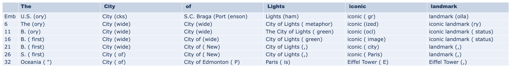

# On the Representations of Entities in Auto-regressive Large Language Models

 ### [🚀 Project page](https://victormorand.github.io/EntityRepresentations/) | [🎓 arxiV]()

This repository contains the codebase for the paper _"On the Representations of Entities in Auto-regressive Large Language Models"_. 
Our code is based on [TransformerLens](https://github.com/TransformerLensOrg/TransformerLens/tree/main), an interpretability library that allows to harmonize various LLM hooks and loadings.




## Our method - Entity Mention Reconstruction

Here is an animation showcasing our our contextual decoding Setup (Section 3.1, p.3).


## Installation

### Environment
this project is built on Pytorch, which can be installed from [here](https://pytorch.org/get-started/locally/)
then the environment can be set up with pip 

Optionnally create a special env for
```
python -m venv env 
source env/bin/activate
pip install --upgrade pip
```
and then install the requirements

```
pip install -r requirements.txt
```

## Demo Usage

- `Demo.ipynb` presents a walkthrough as well as a demo of the Entity Lens.
