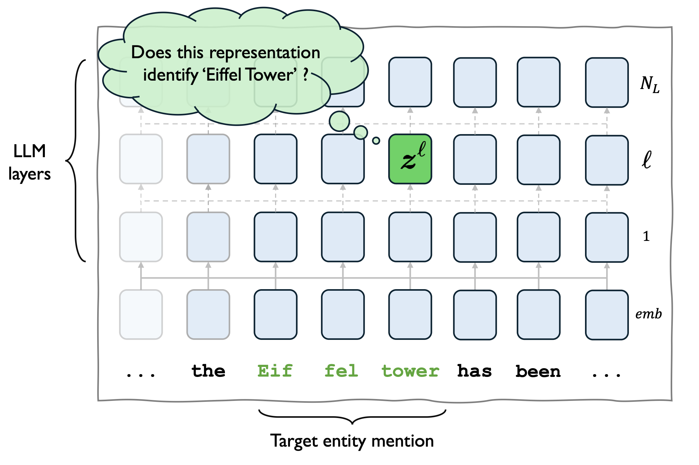
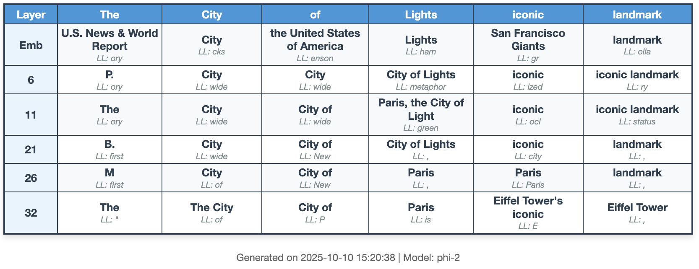

# On the Representations of Entities in Auto-regressive Large Language Models
### [🎓 arxiV](https://arxiv.org/abs/2510.09421)

This repository contains the codebase for the paper _"On the Representations of Entities in Auto-regressive Large Language Models"_. 

<p align="center">
    
</p>


## Abstract
_Named entities are fundamental building blocks of knowledge in text, grounding factual information and structuring relationships within language. Despite their importance, it remains unclear how Large Language Models (LLMs) internally represent entities. Prior research has primarily examined explicit relationships, but little is known about entity representations themselves. We introduce entity mention reconstruction as a novel framework for studying how LLMs encode and manipulate entities. We investigate whether entity mentions can be generated from internal representations, how multi-token entities are encoded beyond last-token embeddings, and whether these representations capture relational knowledge. 
Our proposed method, leveraging _task vectors_, allows to consistently generate multi-token mentions from various entity representations derived from the LLMs hidden states. We thus introduce the _Entity Lens_, extending the _logit-lens_ to predict multi-token mentions.
Our results bring new evidence that LLMs develop entity-specific mechanisms to represent and manipulate any multi-token entities, including those unseen during training._

### Quick Demo


## Our method - Entity Mention Reconstruction

Here is an animation showcasing our our contextual decoding Setup (Section 3.1, p.3).


# Reproduce Experiments 

## Installation

Our code is based on [TransformerLens](https://github.com/TransformerLensOrg/TransformerLens/tree/main), an interpretability library that allows to harmonize various LLM hooks and loadings.


### With `uv`
We recommend using [`uv`](https://docs.astral.sh/uv/), a super-fast envirionment manager. 
you can create a local `venv` synced with this project using :

```bash
uv sync
```

### With Venv
this project is built on Pytorch, which can be installed from [here](https://pytorch.org/get-started/locally/)
then the environment can be set up with pip.

Optionnally create a special env for
```
python -m venv env 
source env/bin/activate
pip install --upgrade pip
```
and then install the requirements

```
pip install -r requirements.txt
```

## Demo Usage

You can launch a jupyter notebook in the root of this repo with
```bash
cd entityrepresentations
uv run --active jupyter notebook --no-browser --port=8383 --NotebookApp.allow_origin='*' 
```

- `Demo.ipynb` presents a walkthrough as well as a demo of the Entity Lens.
- `EntityRepresentations.ipynb` contains much more (uncleaned) code for various experiments.

## Reproducing experiments 

For experiments, we rely on [experimaestro](https://github.com/experimaestro/experimaestro-python), a powerful experiment and configuration manager. 

Once experimaestro is setup, you can run the experiments with 
```bash 
(uv run) experimaestro run-experiment experiments/no_context.yaml 
```

## Citation 
If you find our work useful, please cite it as: 

```yaml
@misc{morand2025representationsentitiesautoregressivelarge,
      title={On the Representations of Entities in Auto-regressive Large Language Models}, 
      author={Victor Morand and Josiane Mothe and Benjamin Piwowarski},
      year={2025},
      eprint={2510.09421},
      archivePrefix={arXiv},
      primaryClass={cs.CL},
      url={https://arxiv.org/abs/2510.09421}, 
}
```
Feel free to leave an issue if you have any problem using our code.
